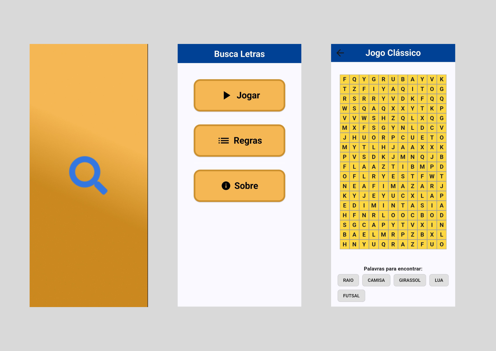
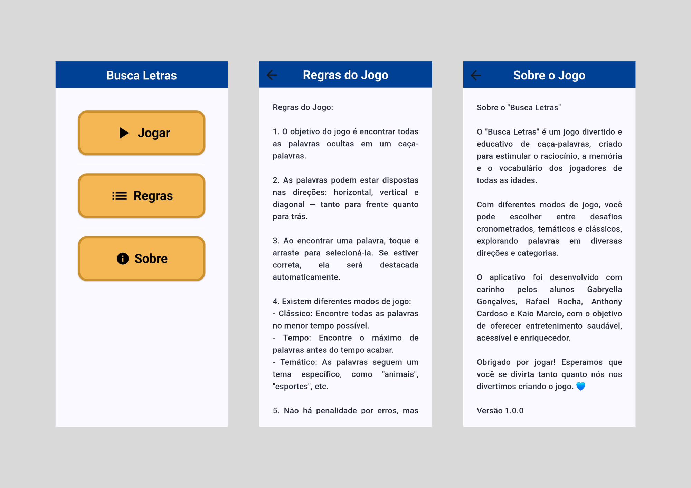
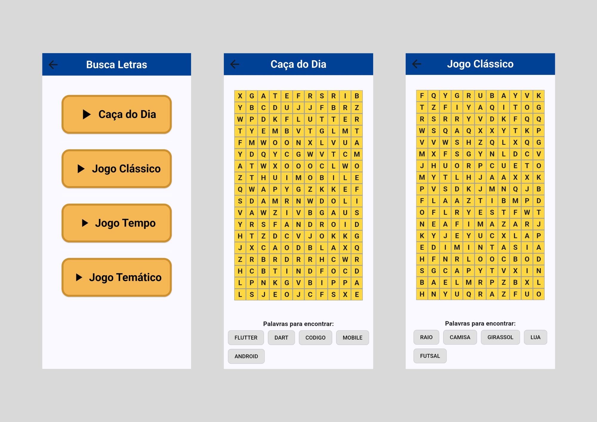
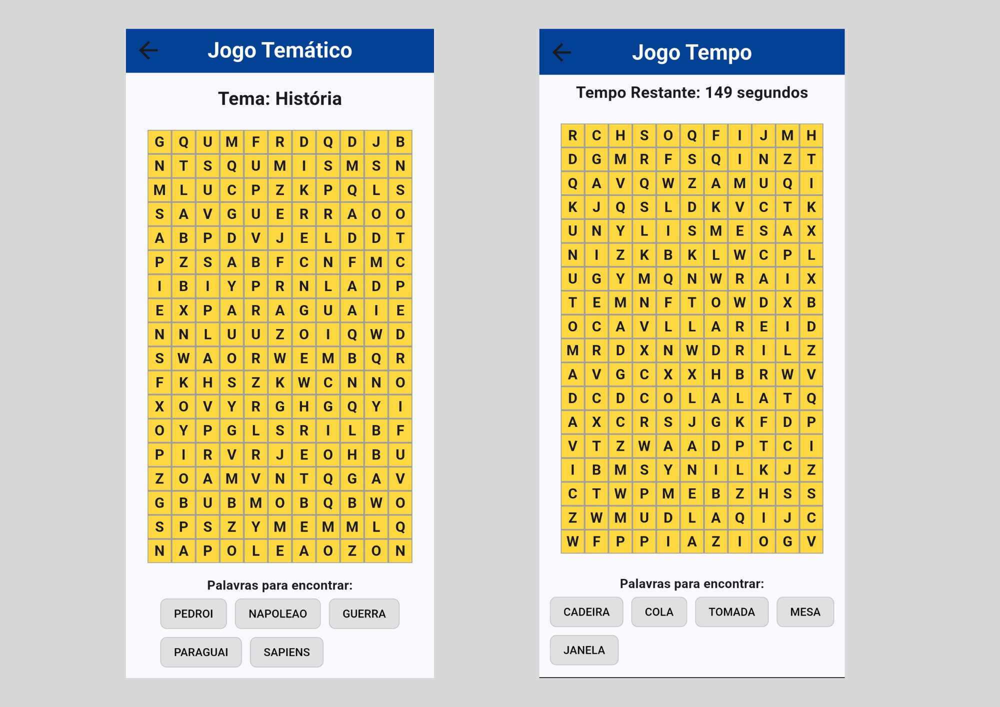

# 🔠 Busca Letras – Jogo Mobile de Caça-Palavras



**Busca Letras** é um jogo de caça-palavras interativo e desafiador, desenvolvido para dispositivos móveis com Flutter. Ideal para todas as idades, o jogo estimula vocabulário, memória e raciocínio lógico, combinando diversão com aprendizado.

---

## 🎯 Objetivo do Jogo

O *Busca Letras* foi criado para proporcionar uma experiência lúdica e educativa. O jogador precisa encontrar palavras escondidas em uma grade de letras — dispostas horizontal e verticalmente.

Com temas variados e múltiplos níveis de dificuldade, o jogo mantém o desafio constante enquanto desenvolve habilidades cognitivas.

---

## 🎮 Funcionalidades

- **Modos de Jogo**:
  - **Clássico**: Encontre todas as palavras.
  - **Tempo**: Encontre o máximo de palavras antes que o tempo acabe.
  - **Temático**: As palavras seguem um tema específico, como "animais", "esportes", entre outros.

- **Grade de Jogo**:
  - A grade de letras permite encontrar palavras na horizontal e vertical.
  - As palavras são inseridas em posições aleatórias, garantindo um desafio dinâmico.

- **Interatividade**:
  - O jogador pode arrastar para selecionar palavras, que são destacadas automaticamente quando corretas.

- **Interface Personalizada**:
  - Interface limpa e intuitiva, com `AppBar` customizada e botões que facilitam a navegação.
  - Suporte a múltiplos modos de visualização e navegação da lista de palavras.

---

## 📱 Como Jogar

1. Escolha um tema.
2. Visualize a lista de palavras que devem ser encontradas.
3. Toque e arraste sobre as letras para selecionar as palavras.
4. Encontre todas as palavras para completar o nível!

---

## 🛠️ Tecnologias Utilizadas

- **Flutter** – Framework multiplataforma para desenvolvimento mobile
- **Dart** – Linguagem de programação
- **Android Studio** – IDE para desenvolvimento
- **Figma** – Ferramenta para prototipação e design da interface

---

## 🚀 Instalação

### Pré-requisitos

- [Flutter](https://flutter.dev/docs/get-started/install) instalado.
- [Android Studio](https://developer.android.com/studio) ou outra IDE de sua preferência.

### Passos para rodar o projeto

```bash
git clone https://github.com/seu-usuario/busca-letras.git
cd busca-letras
flutter pub get
flutter run
```

---

## 📁 Estrutura do Projeto

```plaintext
lib/
│
├── main.dart
│
├── screen/
│   ├── screen_inform.dart
│   ├── screen_menu.dart
│   ├── screen_play.dart
│   ├── screen_playclassic.dart
│   ├── screen_playday.dart
│   ├── screen_playtema.dart
│   ├── screen_playtemp.dart
│   └── screen_rules.dart
│
├── utils/
│   └── puzzle_generator.dart
│
├── widget/
│   └── widget_word_search.dart
```

---

## 📸 Capturas de Tela





---

## ✍️ Equipe de Desenvolvimento

- [Gabryella Gonçalves](https://github.com/gabys12-dev) – Interface e lógica do jogo  
- [Antonhy Cardoso](https://github.com/Anthony2038) – Temas e mecânica de seleção  
- [Kaio Marcio](https://github.com/Kaioz47) – Sistema de pontuação e níveis  
- [Rafael Rocha](https://github.com/Rafaremo33) – Organização do código e documentação 

---

## 💡 Contribuições
Contribuições são bem-vindas! Sinta-se à vontade para abrir issues, sugerir melhorias ou enviar pull requests.

---

## 📄 Licença
Este projeto está licenciado sob a MIT License.
